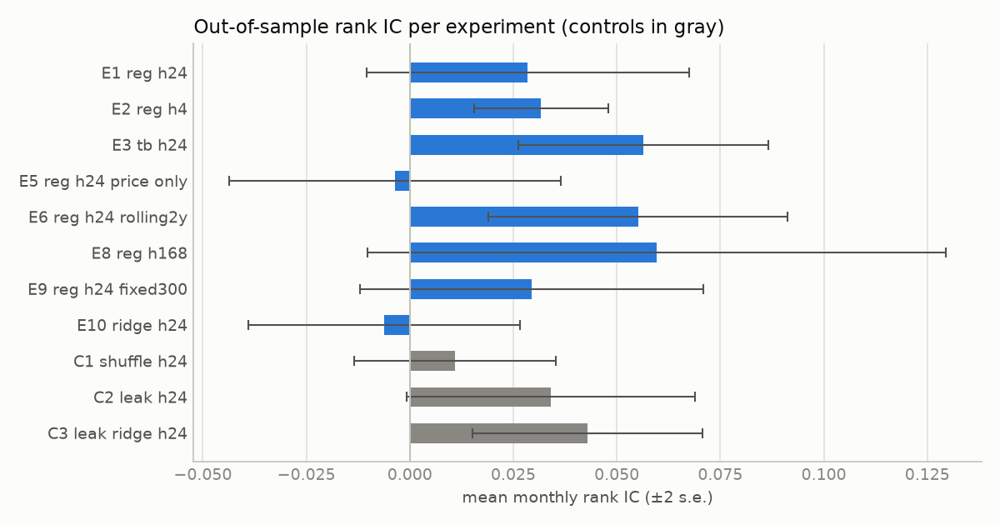
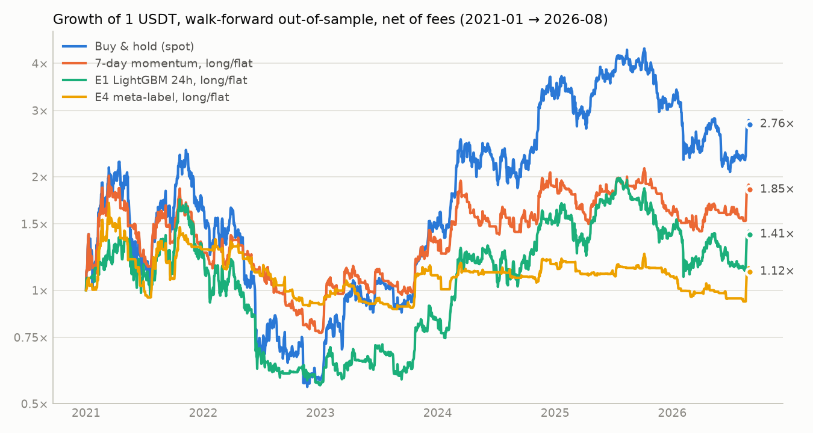
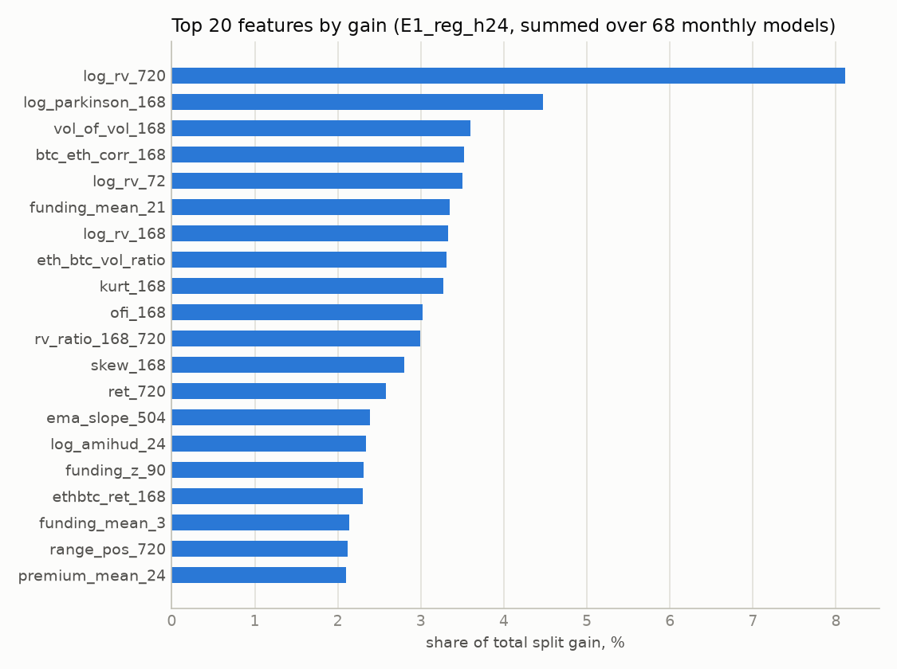

# LightGBM 预测 BTC：全网调研 → 共识方法 → 可复现算法 → 真实数据验证

> 这不是投资建议。所有结论都来自公开资料和本目录代码在 Binance 公开数据上的 walk-forward 回测，
> 回测不等于实盘。

## 结论先行

- **全网"反复验证过"的不是某个神奇模型，而是一套方法**：目标用（波动率标准化的）收益或三重障碍标签，特征用平稳化的多周期价量、波动率、跨资产和资金费率，验证用 purged walk-forward，参数保守，最后按扣费后的结果评估。Kaggle G-Research 加密货币预测赛前三名全是 LightGBM，但他们都说赢在特征工程；严谨的论文和开源复现得到的方向准确率只有 **52%–56%**。
- **在真实 BTC 数据上的复现结果和这一点完全一致**（2021-01 → 2026-08，13 组实验，每组 68 次月度重训、约 5 万个逐小时样本外预测）：
  - 方向信号**真实但很弱**。最好的是三重障碍标签：方向 AUC 0.522、命中率 52.2%，月度 IC 的 t 值 3.7。4 小时周期的月度 IC 最稳定（t=3.9）。
  - **扣费后，没有一个方向策略在风险调整后显著跑赢买入持有**（持有：年化 19.2%，夏普 0.59，最大回撤 −77%）。最接近的是一周周期模型 E8：只做多现货年化 23.1%、夏普 0.68、回撤 −59.5%，但 Deflated Sharpe 只有 0.76（< 0.95），相对 BTC 的 alpha 在统计上不显著。
  - **短周期被手续费吃掉**：4h 多空策略扣费前夏普 1.51，5bp 手续费后 0.41，10bp 时变成 −0.69。
  - **强烈依赖市场状态**：每个方向模型都有亏损年份。只用 BTC 自身价量特征时（E5）完全没有信号，那点信号来自 ETH 和资金费率 / 基差特征。
  - **LightGBM 真正的强项是波动率**：未来 24h 波动率的预测与实际相关 0.75，相对朴素模型的 R² 为 0.47，HAR 模型只有 0.30。
  - **换模型没用，瓶颈在信息本身**：真实数据上，早停、固定 300 棵树和 Ridge 线性模型的结果差不多。阳性对照还显示，对一个已知相关系数为 0.1 的线性信号，LightGBM 只兑现了 Pearson IC 0.029，Ridge 兑现了 0.077——在弱线性信号上，树模型并不占优。
- **建议用法**：用 LightGBM 预测波动率来定仓位和杠杆；做低频（周级）只做多的择时倾斜；或者用 meta-labeling 过滤已有的趋势信号（本测试中多空回撤从 −80% 降到 −43%）。**不要**用小时级方向预测做高频多空。

---

## 目录

1. [调研了什么（论文 / 竞赛 / 开源项目 / 教程）](#1-调研了什么)
2. [被反复验证的共识（11 条）](#2-被反复验证的共识)
3. [算法：从数据到仓位的完整流程](#3-算法)
4. [真实数据验证（2021-01 → 2026-08，68 次月度重训）](#4-真实数据验证)
5. [结论与使用建议](#5-结论与使用建议)
6. [复现](#6-复现)
7. [参考来源](#7-参考来源)

---

## 1. 调研了什么

### 1.1 学术论文

| 来源 | 做法 | 关键结果 | 可信度 / 备注 |
|---|---|---|---|
| Sun, Liu, Sima (2020), *Finance Research Letters* 32 [[1]](#ref1) | LightGBM 预测加密货币"跌 / 不跌"，42 个币的日线 + 宏观指标 | LightGBM 优于 SVM、RF；2 周周期比 2 天更准，最高准确率 0.905 / 0.952 | 最常被引用的 "LightGBM + 加密货币" 论文；准确率远高于其他所有研究，可能和趋势型标签、重叠窗口或样本切分方式有关，**其他研究没有复现出这个量级** |
| Jaquart, Dann, Weinhardt (2021), *J. Finance & Data Science* [[2]](#ref2) | BTC 1–60 分钟方向预测；技术 / 链上 / 情绪 / 资产特征；GBC、RF、LSTM、GRU、LR | 梯度提升和 RNN 最好；**周期越长越可预测**；技术面特征最重要；多空策略扣费前月收益可达 39%，**扣费后为负** | 设计规范，结论被后续项目反复印证 |
| Jaquart, Köpke, Weinhardt (2022), *JFDS* 8 [[3]](#ref3) | 100 个币的日度相对涨跌 | 平均准确率 **52.9%–54.1%**；只看每类置信度最高的 10% 时升到 **57.5%–59.5%** | 给出了真实的"天花板"量级 |
| Liu & Tsyvinski (2021), *Review of Financial Studies* [[4]](#ref4) | BTC/ETH/XRP 收益的风险因子与可预测性 | **时间序列动量**很强；关注度（Google 搜索）1 个标准差 → BTC 未来 2 周收益 +2.3% | 顶刊，动量是加密货币最稳健的信号 |
| Liu, Tsyvinski, Wu (2022), *Journal of Finance* [[5]](#ref5) | 横截面因子 | 市场、规模、**动量**三因子解释加密货币收益 | 顶刊 |
| Shen, Urquhart, Wang (2022), *Financial Review* [[6]](#ref6) | BTC 日内动量 | 以成交量定义"开盘"，首个半小时收益正向预测最后半小时；高成交量 / 高波动时段最强 | 支持"时间 + 成交量"类特征 |
| 集成学习 vs 深度学习比较 (2024), *Int. Review of Financial Analysis* [[7]](#ref7) | RF / GBM / XGBoost / LightGBM / LSTM / GRU 等 | **LightGBM 在 BTC、ETH、LTC 上排名第一**，XRP 上 GRU 第一；集成模型在不同市场状态下更稳定 | 支持"LightGBM 是强基线" |
| BTC 波动率预测 (2024–2025, *JIFMIM*、*Expert Systems with Applications*) [[8]](#ref8) | LightGBM / XGBoost / HAR / GARCH | LightGBM 在确定性和概率性波动率预测上都有效；加入 HAR 分量（日/周/月已实现波动）显著提升 | **波动率比方向好预测得多** |
| López de Prado (2018), *JPM* "The 10 Reasons Most ML Funds Fail" [[9]](#ref9) | 方法论 | 10 个坑：Sisyphus 范式、靠回测做研究、时间采样、整数差分、固定周期标签、方向与仓位一起学、非 IID 样本权重、**交叉验证泄漏**、walk-forward 单路径、**回测过拟合** | 对应解法：特征重要性、成交量时钟、分数差分、**三重障碍**、**meta-labeling**、唯一性权重、**purging + embargo**、CPCV、**Deflated Sharpe** |
| Joubert (2022), *JFDS* "Meta-Labeling: Theory and Framework" [[10]](#ref10) | 控制实验 | meta-labeling 可以过滤假阳性、用于仓位管理，改善夏普和最大回撤；多状态、非线性数据上集成更有利 | Hudson & Thames 开源代码 |
| Bisdoulis (2025), arXiv 2501.07580 [[11]](#ref11) | LightGBM 资产预测的目标变换 | 7 种目标变换中 **log 收益、收益、EMA 差比** 最好 | 支持"不要回归价格" |
| **反例**：Twitter + LGBM (arXiv 2409.15988) [[12]](#ref12) | 推文语义向量 + LightGBM | 小时 / 4 小时 / 日线"准确率" 78%–94% | 用**同期**推文解释同期涨跌，是"解释"不是"预测"，不能交易 |
| Turn-of-the-candle (2023, PMC) [[13]](#ref13) | 1 分钟 BTC | 收益集中在每 15 分钟 K 线切换的那一分钟，t 值 > 9 | 分钟级季节性真实存在，但只对分钟级交易有意义 |

### 1.2 竞赛（最接近"大规模反复验证"的证据）

| 竞赛 | 设定 | LightGBM 相关结论 |
|---|---|---|
| **Kaggle G-Research Crypto Forecasting**（2021-11 → 2022-05，1946 队，3 个月实盘数据评估）[[14]](#ref14) | 14 个币、分钟 K 线，预测未来 15 分钟**剔除市场后的残差收益**，指标为加权相关系数 | **前三名全部用 LightGBM**；主办方总结：*冠军们一致认为特征工程贡献最大，比模型开发影响大得多*。第 2 名：LightGBM 平方损失、除树数/叶子数/学习率外全默认，**6 折 walk-forward、每折 40 周、折间隔 1 周**；第 3 名：只用收盘价派生特征 `log(close / 滚动均价)`、`log(close / 滞后收盘价)` 及其**减去全市场均值**的版本，EmbargoCV；第 9 名：按上涨 / 下跌 / 震荡训练 3 个 LightGBM 专家模型，Hull MA（窗口 55/210/340/890/3750）是最重要特征 [[15]](#ref15) |
| **Kaggle DRW Crypto Market Prediction**（2025，1091 队）[[16]](#ref16) | 订单簿 / 成交流特征预测未来收益 | 有效特征集中在**订单不平衡、主动成交不平衡、流动性、多周期成交量**；冠军称"特征质量高时线性模型就很强" |
| **Numerai Crypto** [[17]](#ref17) | 自带特征预测代币收益排名 | 官方示例就是 LightGBM：`n_estimators=2000, learning_rate=0.01, max_depth=5, num_leaves=32, colsample_bytree=0.1`——小学习率 + 强列采样 |

### 1.3 开源项目

| 项目 | 做法 | 结论 |
|---|---|---|
| **freqtrade / FreqAI** [[18]](#ref18) | `LightGBMRegressor` / `LightGBMClassifier`；特征 = RSI、MFI、ADX、SMA、EMA、布林带、ROC、相对成交量 × 多周期 × 多时间框架 × 相关币对 × 前几根 K 线平移；目标 = 未来 `label_period_candles` 根 K 线收盘均值 / 当前收盘 − 1；**滚动重训**（示例训练 15 天、回测 7 天），SVM 去离群点、DI 阈值 | 最成熟的实盘框架，"多周期技术特征 + 收益率目标 + 滚动重训"范式 |
| **microsoft/qlib** [[19]](#ref19) | LightGBM + Alpha158 基准 | 参数：`lr 0.2, num_leaves 210, max_depth 8, lambda_l1 205.7, lambda_l2 580.98, colsample 0.888, subsample 0.879`——**极强的 L1/L2 正则**；Alpha158 的 K 线形态 + 多窗口统计因子是很好的特征模板 |
| **Hassnat07/crypto-ml-backtest** [[20]](#ref20) | BTC/ETH/SOL/BNB 4 小时线 2020–2026，29 个特征，三重障碍标签，5 折 purged walk-forward，**预注册**判定标准 | BTC AUC **0.554**，精度比基准高 8.3pp，但 0.30% 往返成本下每笔净 **−0.021%**，结论 NO-GO；**2022 熊市 AUC 0.416，2024 年 0.625——"模型是牛市探测器"** |
| **intikhab49/edgeproof** [[21]](#ref21) | 15 分钟线，LightGBM / LSTM，三重障碍、purged k-fold、唯一性权重、Deflated Sharpe，**阳性对照** | 方向模型扣 taker 费后**无优势**（利润因子 0.65–0.98）；阳性对照能被检测出来；**波动率预测**比基准好 9.6% |
| **hudson-and-thames** mlfinlab / meta-labeling [[10]](#ref10) | López de Prado 方法的参考实现 | 三重障碍、purged CV、meta-labeling 的标准代码 |
| 中文社区（知乎 / CSDN / 腾讯云 / VeighNa / BigQuant）[[22]](#ref22) | 大多是 G-Research 或 Optiver 方案的复述，或"技术指标 + LightGBM + 滚动训练" | 很多教程**直接回归价格或随机切分**，图看起来很准，实际是滞后复制 |
| Flovik, *How (not) to use ML for time series forecasting* [[23]](#ref23) | 教程 | 演示了"预测价格"的模型只是把昨天的值平移一格，看似准确毫无预测力 |

---

## 2. 被反复验证的共识

按"支持它的独立来源数量"排序：

1. **目标用（波动率标准化的）收益率 / 方向 / 三重障碍，绝不用价格。** 价格回归只学到"明天 ≈ 今天"。G-Research 用残差收益、Numerai 用收益排名、FreqAI 用未来均价收益率、Bisdoulis 的对比实验都指向同一结论。[[11]](#ref11)[[14]](#ref14)[[18]](#ref18)[[23]](#ref23)
2. **LightGBM 是表格型金融特征的默认强基线，但特征工程比模型重要。** G-Research 前三全是 LightGBM 且都说特征最重要；IRFA 2024 中 LightGBM 在 BTC 上第一；Jaquart 2021 中 GBC 和 RNN 并列最好。[[2]](#ref2)[[7]](#ref7)[[14]](#ref14)
3. **有效特征族几乎固定**：多周期收益（动量 / 反转）、价格相对均线和区间位置、已实现波动率、成交量与**主动买卖不平衡**、时间（小时 / 星期）、跨资产（ETH、市场均值）、衍生品（资金费率、基差）。技术面最重要，链上 / 情绪次之。[[2]](#ref2)[[4]](#ref4)[[6]](#ref6)[[15]](#ref15)[[16]](#ref16)[[18]](#ref18)
4. **所有特征要平稳化**：用收益率、比值、z-score、除以近期波动率，而不是价格、成交量的绝对水平。[[9]](#ref9)[[15]](#ref15)[[19]](#ref19)
5. **验证只能用 walk-forward + purge + embargo。** 随机 K 折会泄漏未来。G-Research 第 2 名 1 周间隔、第 3 名 EmbargoCV、FreqAI 滚动重训、López de Prado 坑 #8。[[9]](#ref9)[[14]](#ref14)[[18]](#ref18)
6. **信号很弱是常态**：方向准确率 52%–56%、AUC 0.52–0.58；高置信子集更准。论文或教程里 70%–95% 的"准确率"几乎都来自泄漏、同期解释或随机切分。[[3]](#ref3)[[12]](#ref12)[[20]](#ref20)
7. **交易成本决定生死，周期越长越好做。** 分钟到 15 分钟级扣费后普遍为负；可预测性随周期上升。[[2]](#ref2)[[20]](#ref20)[[21]](#ref21)
8. **强烈依赖市场状态**，常常只是"牛市探测器"——必须滚动重训，并且**分年**报告结果。[[20]](#ref20)
9. **波动率远比方向好预测**，LightGBM + HAR 分量做波动率预测被多篇研究验证，最直接的用途是仓位管理 / 风控。[[8]](#ref8)[[21]](#ref21)
10. **Meta-labeling**：让简单规则（如 7 日动量）决定方向，LightGBM 只决定"做不做 / 做多大"，比直接预测涨跌更容易提升精度。[[9]](#ref9)[[10]](#ref10)
11. **LightGBM 参数要保守**：小学习率、浅树、大 `min_data_in_leaf`、强 L1/L2、行列采样、早停、多种子平均；并用 Deflated Sharpe 校正多次试验带来的虚高。[[9]](#ref9)[[17]](#ref17)[[19]](#ref19)

---

## 3. 算法

把上面的共识落成一套可以直接跑的流程（代码在 `lgbm_btc/`）：

```
输入  BTCUSDT 1h K 线（含主动买入量、成交笔数）、ETHUSDT 1h、BTC 永续资金费率、溢价指数（基差）
      全部来自 data.binance.vision 免费公开归档

0. 时间约定  第 t 根 K 线在收盘时（open_time + 1h）做决策；特征只用 ≤ t 的数据，标签只用 > t 的数据
1. 波动率尺度  σ_t = EWMA_std(1h 对数收益, span = 168)
2. 特征（100 个，全部因果、平稳化）
   动量      ret_k = log(C_t / C_{t-k}) / (σ_t·√k),  k ∈ {1,2,4,8,12,24,48,72,120,168,336,504,720}
   趋势      log(C / EMA_n) / (σ·√n)、EMA 斜率、Hull MA 偏离（n = 55, 210）、EMA24/168 交叉
   区间      (C − 最低) / (最高 − 最低)、距 n 小时最高 / 最低的标准化距离，n ∈ {24, 168, 720}
   振荡      RSI(14/48/168)、Stoch、MACD 柱 / (C·σ)、布林 %B、ADX、DI 差、MFI
   波动      已实现波动(6..720)、波动比、Parkinson、Garman-Klass、ATR/σ、偏度、峰度、下行方差占比、波动的波动
   量 / 流   成交额 z-score、相对成交额、成交笔数 z、平均单笔 z、主动买卖不平衡 OFI(1/6/24/168)、Amihud、量价相关
   K 线形态  实体、上下影线比例、振幅/σ
   时间      小时、星期
   跨资产    ETH 多周期收益、ETH/BTC 比值动量、BTC-ETH 相关、波动比
   衍生品    最近一次资金费率、1 天 / 7 天均值、30 天 z-score；溢价指数及其 24h 均值、z-score、变化
3. 标签（主模型）  y_t = log(C_{t+H} / C_t) / (σ_t·√H)，训练时截断到 ±4
   备选：三重障碍（±1·σ·√H，先碰哪边）、meta 标签（7 日动量方向这笔交易是否赚钱）、未来 H 小时已实现波动率
4. 验证  每月 1 日重训一次；训练集 = 2018-01-01 至（本月第一根 K 线 − H − 24 根）；
         其中最后 15% 做早停验证集，与训练集之间再 purge H 根
5. 模型  LightGBM：learning_rate 0.02、num_leaves 31、max_depth 6、min_data_in_leaf 500、
         feature_fraction 0.6、bagging_fraction 0.7、lambda_l2 10；
         早停指标 = 验证集 Pearson IC（patience 200）；按数据量等比放大树数后在 train+valid 上重训；3 个种子平均
6. 信号 → 仓位  s_t = sign(ŷ_t)；pos_t = mean(s_{t−H+1..t})（H 个重叠子组合，各持有 H 小时，天然降换手）
         多空版：永续合约，5 bp/边 + 资金费；只做多版：现货，10 bp/边
7. 评估  月度 Rank IC 及 t 值、方向 AUC、分年夏普、扣费净值、换手、Deflated Sharpe（按全部试过的策略变体校正）
8. 对照  阴性：打乱训练标签；阳性：加入一个与未来标签相关系数 ≈ 0.1 的"泄漏"特征。
         阴性必须没信号、阳性必须被检测到，否则整条流水线不可信
```

`tests/test_leakage.py` 自动检查：截断未来数据后特征不变（point-in-time）、资金费率只在结算后可见、标签不越过 H、各折之间正确 purge、回测时序约定，以及在纯随机游走上必须测不出信号。

---

## 4. 真实数据验证

### 4.1 设置

- **数据**：Binance 公开归档。BTCUSDT、ETHUSDT 现货 1h K 线，2017-08-17 → 2026-08-31，共 79,244 根（交易所停机造成的 170 根缺失已补齐）；BTCUSDT 永续资金费率，2020-01 起共 7,305 次结算；溢价指数 1h。
- **样本外**：训练从 2018-01-01 开始，用扩展窗口。测试期 2021-01-01 → 2026-08-31，每月 1 日重训一次，共 68 个模型，每组实验约 49,600 个逐小时样本外预测。这段时间覆盖了 2021 年牛市、2022 年熊市（−65%）、2023–2024 年大牛市和 2025–2026 年震荡，BTC 从约 2.9 万涨到 7.86 万。
- **成本**：永续合约每边 5bp，并按实际资金费率计费（多头付正费率）；现货每边 10bp。
- **实验清单**：E1–E8 和 C1/C2 在看到任何测试结果之前就写死在 `run_experiments.py` 里。E9 是在训练日志显示早停常常只选 1–10 棵树之后加的；E10/C3 是在看到 C2 结果之后加的。这几组都照实列出，并计入 Deflated Sharpe 的试验次数（共 18 个策略变体）。

### 4.2 预测质量

| 实验 | 月均 Rank IC | t 值 | IC>0 月份 | 方向 AUC | 方向命中率 | 高置信 10% 命中率 | 中位树数 |
|---|---:|---:|---:|---:|---:|---:|---:|
| E1 回归 24h（主模型） | +0.0285 | +1.46 | 64.7% | 0.5037 | 50.2% | 52.5% | 12 |
| E2 回归 4h | +0.0317 | +3.91 | 70.6% | 0.5125 | 50.9% | 52.4% | 112 |
| E3 三重障碍 24h | +0.0564 | +3.73 | 72.1% | **0.5219** | **52.2%** | 54.0% | 98 |
| E5 仅价量特征 24h | −0.0035 | −0.17 | 48.5% | 0.4947 | 50.6% | 51.4% | 12 |
| E6 滚动 2 年窗口 24h | +0.0551 | +3.06 | 67.7% | 0.5031 | 51.1% | 54.8% | 12 |
| E8 回归 168h（一周） | +0.0596 | +1.71 | 60.3% | 0.5025 | 52.5% | 56.0% | 15 |
| E9 固定 300 棵树 24h | +0.0294 | +1.42 | 64.7% | 0.5042 | 50.3% | 53.9% | 300 |
| E10 Ridge 线性模型 24h | −0.0062 | −0.38 | 47.1% | 0.5012 | 50.3% | 50.6% | – |
| C1 阴性对照（打乱标签） | +0.0109 | +0.89 | 50.0% | 0.5051 | 51.4% | 53.2% | 10 |
| C2 阳性对照（泄漏特征 ρ≈0.1） | +0.0340 | +1.95 | 66.2% | 0.5064 | 51.5% | 51.1% | 20 |
| C3 阳性对照 + Ridge | +0.0429 | +3.09 | 61.8% | 0.5207 | 51.6% | 55.1% | – |

"高置信 10%"是指 |预测值| 超过过去 30 天滚动 90% 分位数时的命中率，阈值只用过去的数据。E7（波动率）和 E4（meta-label）的指标见下文。

<picture>
  <source media="(prefers-color-scheme: dark)" srcset="results/ic_dark.png">
  
</picture>

**Meta-labeling（E4）**：主策略是 7 日动量定方向，LightGBM 判断这一笔在 24h 内能否赚钱。

| meta 模型 AUC | 7 日动量本身胜率 | LightGBM 过滤后胜率 | 保留交易比例 | 高置信 10% 方向命中率 |
|---:|---:|---:|---:|---:|
| 0.5209 | 48.5% | 50.8% | 36.2% | 55.7% |

### 4.3 策略绩效（2021-01 → 2026-08，已扣手续费和资金费）

仓位规则对所有模型都一样：取预测值的符号，再对最近 H 根的符号取平均（H 个重叠子组合）。LS = 永续多空，LO = 现货只做多。

| 策略 | 年化(CAGR) | 夏普 | 最大回撤 | 年换手(倍) | 年手续费 | 年资金费 | DSR | 夏普@0bp | 夏普@10bp |
|---|---:|---:|---:|---:|---:|---:|---:|---:|---:|
| 买入持有（现货） | 19.2% | 0.59 | −77.2% | 0 | 0.0% | 0.0% | | | |
| 永续一直做多（含资金费） | 7.0% | 0.41 | −79.2% | 0 | 0.0% | 10.8% | | | |
| 7 日动量 · LS | −10.4% | 0.06 | −79.7% | 133 | 6.6% | 4.5% | | | |
| 7 日动量 · LO | 11.5% | 0.48 | −62.0% | 67 | 6.7% | 0.0% | | | |
| E1 回归 24h · LS | −10.5% | 0.05 | −74.7% | 128 | 6.4% | 2.2% | 0.21 | 0.17 | −0.08 |
| E1 回归 24h · LO | 5.6% | 0.35 | −69.2% | 64 | 6.4% | 0.0% | 0.48 | | |
| E2 回归 4h · LS | 8.4% | 0.41 | −59.6% | 1079 | 53.9% | 0.7% | 0.54 | **1.51** | −0.69 |
| E2 回归 4h · LO | −8.4% | 0.02 | −75.1% | 539 | 53.9% | 0.0% | 0.19 | | |
| E3 三重障碍 24h · LS | 6.6% | 0.36 | −64.8% | 232 | 11.6% | 1.0% | 0.48 | 0.63 | 0.10 |
| E3 三重障碍 24h · LO | 11.7% | 0.47 | −68.5% | 116 | 11.6% | 0.0% | 0.59 | | |
| E4 meta-label · LS | 5.6% | 0.33 | **−43.2%** | 125 | 6.3% | 3.2% | 0.45 | 0.55 | 0.12 |
| E4 meta-label · LO | 2.2% | 0.21 | −48.1% | 66 | 6.6% | 0.0% | 0.33 | | |
| E5 仅价量特征 · LS | −15.8% | −0.08 | −86.6% | 126 | 6.3% | 5.2% | 0.14 | 0.05 | −0.20 |
| E5 仅价量特征 · LO | 3.5% | 0.31 | −71.5% | 63 | 6.3% | 0.0% | 0.44 | | |
| E6 滚动 2 年 · LS | 2.9% | 0.32 | −66.0% | 105 | 5.2% | 4.9% | 0.45 | 0.42 | 0.22 |
| E6 滚动 2 年 · LO | 15.0% | 0.53 | −61.4% | 52 | 5.2% | 0.0% | 0.65 | | |
| E8 回归 168h · LS | 15.4% | 0.54 | **−42.5%** | 29 | 1.4% | 5.2% | 0.65 | 0.57 | **0.51** |
| **E8 回归 168h · LO** | **23.1%** | **0.68** | −59.5% | 14 | 1.4% | 0.0% | **0.76** | | |
| E9 固定 300 棵树 · LS | −10.0% | 0.02 | −75.5% | 199 | 9.9% | −0.9% | 0.20 | 0.23 | −0.18 |
| E9 固定 300 棵树 · LO | 4.5% | 0.31 | −57.1% | 99 | 9.9% | 0.0% | 0.44 | | |
| E10 Ridge · LS | 6.5% | 0.36 | −55.8% | 218 | 10.9% | −1.2% | 0.48 | 0.61 | 0.11 |
| E10 Ridge · LO | 12.4% | 0.50 | −60.3% | 109 | 10.9% | 0.0% | 0.61 | | |

DSR（Deflated Sharpe Ratio）是指：在试过 18 个策略变体的前提下，真实夏普大于 0 的概率。通常要 ≥ 0.95 才算显著，**这里没有一个达到**。相对买入持有做回归，E8·LO 的年化 alpha 约 +5.9%、alpha 夏普 0.33（t≈0.8）；E8·LS 约 +8.0%，beta 0.48；打乱标签的阴性对照 C1 约 −7.5%，亏的正是手续费和资金费。

<picture>
  <source media="(prefers-color-scheme: dark)" srcset="results/equity_dark.png">
  
</picture>

（图里最后一段近乎垂直的上涨是真实行情：2026-08-18 → 21，BTC 从 6.47 万涨到 7.83 万，单小时成交额最高 6.3 亿美元。）

### 4.4 分年

**分年 Rank IC**

| 实验 | 2021 | 2022 | 2023 | 2024 | 2025 | 2026 |
|---|---:|---:|---:|---:|---:|---:|
| E1 回归 24h | −0.012 | −0.010 | −0.012 | +0.030 | +0.035 | +0.090 |
| E2 回归 4h | +0.059 | +0.028 | +0.029 | +0.050 | −0.004 | +0.015 |
| E3 三重障碍 24h | +0.099 | −0.002 | +0.040 | +0.075 | +0.006 | +0.023 |
| E4 meta-label 24h | +0.084 | +0.065 | +0.021 | +0.092 | +0.033 | −0.049 |
| E5 仅价量特征 24h | −0.046 | −0.021 | −0.080 | +0.007 | −0.014 | +0.092 |
| E6 滚动 2 年 24h | +0.021 | +0.065 | −0.038 | +0.011 | +0.118 | −0.065 |
| E8 回归 168h | +0.068 | +0.079 | −0.025 | +0.039 | +0.030 | −0.142 |
| E9 固定 300 棵树 | +0.013 | +0.006 | −0.018 | +0.011 | +0.050 | +0.070 |
| E10 Ridge 24h | −0.018 | −0.023 | +0.038 | +0.056 | −0.006 | +0.051 |

**分年夏普（LS，扣费和资金费）**

| 实验 | 2021 | 2022 | 2023 | 2024 | 2025 | 2026 |
|---|---:|---:|---:|---:|---:|---:|
| E1 回归 24h | +0.01 | −0.79 | −0.19 | +0.95 | −0.02 | +0.81 |
| E2 回归 4h | +1.13 | −0.03 | +1.34 | +0.75 | −1.56 | +0.23 |
| E3 三重障碍 24h | +1.44 | −1.18 | +1.20 | −0.16 | +0.41 | +0.41 |
| E4 meta-label 24h | +1.00 | +0.29 | −0.03 | −0.45 | −0.58 | +1.58 |
| E5 仅价量特征 24h | −0.45 | −0.46 | −0.61 | +0.76 | −0.33 | +1.67 |
| E6 滚动 2 年 24h | +1.38 | +0.44 | −1.21 | +0.98 | −0.04 | −1.52 |
| E8 回归 168h | +0.70 | −0.09 | +1.58 | +1.05 | +0.09 | −0.08 |
| E9 固定 300 棵树 | +0.26 | −0.42 | −0.93 | −0.34 | +0.98 | +1.03 |
| E10 Ridge 24h | +0.06 | −0.87 | +2.05 | +1.65 | −1.06 | +1.38 |
| 买入持有（现货） | +1.00 | −1.32 | +2.30 | +1.82 | +0.06 | −0.15 |
| 7 日动量 · LS | −0.23 | +0.03 | +0.56 | −0.24 | −0.65 | +1.59 |

### 4.5 对照实验

| 对照 | 月均 Rank IC | t 值 | 方向 AUC | LS 夏普（扣费） |
|---|---:|---:|---:|---:|
| C1 阴性对照（打乱标签） | +0.0109 | +0.89 | 0.5051 | 0.35 |
| C2 阳性对照（泄漏特征 ρ≈0.1）+ LightGBM | +0.0340 | +1.95 | 0.5064 | 0.72 |
| C3 阳性对照 + Ridge | +0.0429 | +3.09 | 0.5207 | 1.09 |
| E1 LightGBM 主模型 | +0.0285 | +1.46 | 0.5037 | 0.05 |
| E10 Ridge 同特征 | −0.0062 | −0.38 | 0.5012 | 0.36 |

- 阴性对照的 IC 和 0 没有显著差异。它的 LS 夏普之所以是 0.35，是因为训练目标均值为正，模型 89% 的时间偏多，吃到的是 BTC 本身的上涨；相对持有的 alpha 是 −7.5%/年。**一个"大部分时间做多"的模型，在牛市里看起来总是不错**，所以必须和持有、和打乱标签的结果对比。
- 阳性对照能被检测出来，说明整条流水线没有把信号弄丢。但 LightGBM 只兑现了一部分：Pearson IC 0.029，Ridge 是 0.077，理论上限约 0.1。

### 4.6 特征重要性（E1，68 个月度模型的增益合计）

<picture>
  <source media="(prefers-color-scheme: dark)" srcset="results/importance_dark.png">
  
</picture>

前 15 名：`log_rv_720`、`log_parkinson_168`、`vol_of_vol_168`、`btc_eth_corr_168`、`log_rv_72`、`funding_mean_21`、`log_rv_168`、`eth_btc_vol_ratio`、`kurt_168`、`ofi_168`、`rv_ratio_168_720`、`skew_168`、`ret_720`、`ema_slope_504`、`log_amihud_24`。排在前面的几乎都是**波动率或状态类**特征（长窗口波动、波动的波动、峰度、偏度、BTC-ETH 相关性、7 天资金费率均值），而不是短期动量。模型主要在学"什么样的环境下更容易涨"，这也解释了它为什么强烈依赖市场状态。

### 4.7 波动率（E7）

| 24h 已实现波动率预测 | MSE（log 波动率） | 相对朴素模型 R² | 与真实值相关 |
|---|---:|---:|---:|
| 朴素（过去 24h 波动 = 未来） | 0.2808 | 0 | 0.589 |
| HAR（日 / 周 / 月） | 0.1975 | +0.297 | 0.649 |
| **LightGBM（100 个特征）** | **0.1480** | **+0.473** | **0.753** |

| 50% 目标波动的现货持仓（每天 00:00 调仓） | 年化 | 夏普 | 最大回撤 | 平均仓位 |
|---|---:|---:|---:|---:|
| 买入持有 | 19.2% | 0.59 | −77.2% | 1.00 |
| 用朴素波动预测定仓位 | 8.9% | 0.42 | −73.6% | 0.89 |
| 用 HAR 定仓位 | 13.7% | 0.51 | −75.5% | 0.93 |
| 用 LightGBM 定仓位 | 14.8% | 0.53 | −74.2% | 0.92 |

波动率模型的早停树数中位数是 458，方向模型只有 12，说明波动率里可学习的结构多得多。但在 2021–2026 年，用它做"目标波动"仓位并没有跑赢满仓持有，原因是 BTC 的高波动时段经常就是大涨时段。所以波动率预测更适合用来定**杠杆上限、止损宽度、期权 / 做市报价**，而不是简单地降仓。

### 4.8 读这些数字的要点

1. **标签比模型重要**：特征和参数完全相同，只把目标从"24h 收益"换成三重障碍（E3），方向 AUC 就从 0.504 升到 0.522，命中率从 50.2% 升到 52.2%。这和 López de Prado"固定周期标签是坑"的判断一致。
2. **周期越长，越能扛住成本**：E8 年换手只有 29 倍，手续费从 0 加到 10bp，夏普只从 0.57 降到 0.51；E2 年换手 1079 倍，同样的变化让夏普从 1.51 掉到 −0.69。这和 Jaquart 2021、Hassnat07 的结论一样。
3. **信号依赖市场状态**：没有一个模型 6 年都赚钱；E1 的 IC 在 2021–2023 年为负，2024–2026 年为正；E8 在 2026 年的 IC 是 −0.14。必须滚动重训、分年看结果，并且接受"某些年份会失效"。
4. **不是换个模型就能解决**：早停和固定树数（E1 vs E9）几乎没有区别，Ridge（E10）和 LightGBM 各有胜负。瓶颈在信息本身。

---

## 5. 结论与使用建议

**一句话：用 LightGBM 预测 BTC，经得起检验的是"方法"，不是"准确率"。** 严格去掉泄漏以后，方向准确率在 52% 左右是常态，扣费后很难稳定跑赢持有。LightGBM 最有价值的用途是预测波动率，以及做低频的择时和过滤。

**按本报告的证据，可以直接用的配置：**

1. **周级方向倾斜（E8）**：用 1h 数据预测未来 168h 的波动率标准化收益，仓位取最近 168 个符号的平均，只做多现货（或低杠杆永续），每月重训一次。换手低、对成本不敏感，2021–2026 年回撤比持有小（−60% vs −77%），但超额收益在统计上不显著。
2. **三重障碍分类（E3）**：用它的概率做仓位倾斜，比如仓位 = 0.5 + k·(p − 0.5)，而不是当作开 / 平仓开关。
3. **波动率模型（E7）做风控**：杠杆上限 = 目标波动 / 预测波动；止损宽度 = k × 预测波动。
4. **Meta-labeling（E4）**：如果已经有趋势或动量策略，用它过滤信号能明显降回撤。本测试中多空版夏普从 0.06 提到 0.33，最大回撤从 −80% 降到 −43%，平均仓位从 0.86 降到 0.33。只做多版本则不如纯动量，要看你的目标是收益还是回撤。

`python predict_latest.py` 会用全部历史训练 E1 配置，并输出最新一根 K 线的信号（换成 `--horizon 168` 即 E8）。

**还想往上走的话，按证据强弱排序：**

1. **换问题**：做多币种横截面，预测相对市场的残差收益，做多强、做空弱。这正是 G-Research、Numerai 里 LightGBM 真正胜出的场景，比单一资产择时稳定得多。
2. **换数据**：订单簿和逐笔主动成交不平衡（DRW 2025 的有效特征）、未平仓量和多空比（Binance `futures/um/daily/metrics`）、链上数据（交易所净流入、MVRV、SOPR）、Google Trends 关注度（Liu & Tsyvinski 2021）。
3. **换执行**：用 Maker 挂单把成本从 5bp 降到约 2bp，E2 的夏普会从 0.41 回到 1.07。但要实测成交率和逆向选择——Hassnat07 发现，没成交的单反而更赚钱。
4. **模型层面**：LightGBM 和 Ridge 集成；按上涨 / 下跌 / 震荡分别训练专家模型（G-Research 第 9 名的做法）；概率先校准再定仓位（Joubert 2023）。

**避坑清单**（看到这些就不要轻信）：回归价格；随机 K 折；特征里用到了当根 K 线之后的数据；把同期"解释"当成预测；只报准确率、不报扣费后收益；只报最好的那个配置；不分年报告；没有阴性 / 阳性对照。

**本报告的局限**：只有一个资产、一段历史（2021–2026）、一家交易所的数据；成本模型只考虑手续费和资金费，没有滑点和冲击成本；当月的资金费率是用溢价指数估算的（只影响 `predict_latest.py`）；DSR 和 PSR 假设收益近似平稳。

---

## 5.5 多币种横截面版本（按第 5 节"换问题"的建议实测）

**做法**（`lgbm_btc/xs.py`、`run_xs.py`，参数在看结果之前定好）：
- 20 个 Binance 现货币种：BTC、ETH、BNB、XRP、ADA、SOL、DOGE、LTC、LINK、DOT、AVAX、TRX、BCH、ETC、XLM、ATOM、UNI、FIL、NEAR、AAVE，使用 1h 数据，上市满 60 天才进入股票池。
- 目标：未来 24h 收益减去当小时全部币的平均收益（即相对市场的残差），再除以该币的波动率。这就是 G-Research 那种"剔除市场"的目标。
- 特征：每个币有 36 个特征（多周期收益、相对市场收益、均线偏离、区间位置、波动率、beta、主动买卖不平衡、流动性等）；这些特征在同一时刻的横截面排名再给 36 个；另有 5 个市场状态特征。共 1,194,021 行。
- 训练和交易：LightGBM 固定 300 棵树、`min_data_in_leaf=2000`，两个种子平均；训练行每 4 小时取一次。每月重训，训练集与测试集之间留 48h 间隔。每天 00:00 UTC 按预测值排序，做多前 20%、做空后 20%，多空各占一半资金、持有 24h，每边 5bp 手续费。
- 对照：同样特征的 Ridge 线性模型、7 日横截面动量、1 日反转。

**结果（2021-01 → 2026-08，2,069 个交易日）**

| 策略 | 日均 Rank IC | IC t 值 | 年化 | 夏普（5bp） | 最大回撤 | 夏普@0bp | 夏普@2bp | 夏普@10bp |
|---|---:|---:|---:|---:|---:|---:|---:|---:|
| **LightGBM 多空** | **0.030** | **4.79** | **59.1%** | **1.75** | **−27.2%** | 2.39 | 2.13 | 1.12 |
| Ridge 多空（同特征） | 0.019 | 2.79 | 51.7% | 1.54 | −20.3% | 2.21 | 1.94 | 0.87 |
| 7 日动量多空 | −0.015 | −2.22 | −4.7% | 0.18 | −65.6% | 0.45 | 0.34 | −0.10 |
| 1 日反转多空 | 0.029 | 4.19 | −28.5% | −0.61 | −88.9% | 0.07 | −0.21 | −1.29 |

LightGBM 多空分年夏普：2021 +3.43、2022 +3.45、2023 +0.32、2024 +1.88、**2025 −1.01**、2026 +0.60。分年 IC 六年全部为正（0.011–0.043）。

**和单币择时的对比**：同样是 LightGBM、同样的方法论，把问题从"BTC 明天涨不涨"换成"哪个币明天比平均强"，IC 的 t 值从 1.5 升到 4.8，扣费后夏普从 0.05 升到 1.75，而且 2022 年熊市也赚钱（多空对冲掉了市场涨跌）。这和 G-Research、Numerai 的经验一致：LightGBM 在**相对**预测上远比在**择时**上有效。1 日反转的 IC 虽然不低，但换手太高，扣费后反而亏钱；LightGBM 的 IC 相近，但排序更稳，所以能扛住成本。

**对 BTC 本身**：模型判断"BTC 明天能否跑赢 20 币平均"的 AUC 为 0.527、命中率 52.8%，比直接预测 BTC 涨跌（AUC 0.504）好一点，但仍然很弱。

**必须注意的偏差（这组结果比单币版更可能高估）**：
1. **幸存者偏差**：币池是按今天仍在交易的主流币挑的，LUNA、FTT 这类归零币不在里面。这对只做多的影响最大——只做多前 20% 的年化 84%，等权持有 20 个币是 34%，这个差距不能当真。对多空的影响小一些，但同样存在。
2. **资金费率没算**：山寨币永续做空经常要付或收较高的资金费；另外有些币当时没有永续可做空，或者借币成本很高。
3. **流动性和冲击成本**：小币按 5bp 成交偏乐观。
4. 2025 年为负，说明这种优势也会衰减。

实盘前至少要做：用当时的市值前 N 名做动态币池（包括后来退市的币）、接入资金费率、用 Maker 成交价回测。

### 5.6 压力测试：动态币池（含归零 / 下架币）+ 资金费率 + 滑点

`lgbm_btc/universe.py`、`run_xs_dynamic.py`。模型和特征与 5.5 节完全相同，只改了下面这些：

- **币池**：候选池 72 个币，包括后来归零、下架或改名的 LUNA、FTT、SRM、WAVES、XMR、MATIC、FTM、RNDR、EOS、OMG、ANKR、ZIL。每月初按**当时**过去 30 天的成交额取前 30 名，并且只选当时已有 USD-M 永续合约、能做空的币。2021 年以后共有 71 个币进过币池，其中 9 个后来退市或归零（EOS、FTM、LUNA、MATIC、OMG、RNDR、SRM、WAVES、XMR）。币在持仓期间下架，就按最后成交价平仓。
- **滑点**：按流动性估算，每边 clip(2·√(10⁹ / 日均成交额), 1, 30) bp。BTC 约 1bp，日成交 5000 万美元的币约 9bp，1000 万美元的币约 20bp。这个模型是我的粗略假设，不是实测。
- **资金费**：用每个币永续合约的真实历史结算记录，持仓 24h 内的每次结算都计入。

**结果（2021-01 → 2026-08）**

| 持仓方式 | 成本口径 | 年化 | 夏普 | 最大回撤 | 日胜率 | 日盈亏比 |
|---|---|---:|---:|---:|---:|---:|
| 每天全换 | 不扣成本 | 150.1% | 3.27 | −17.9% | 58.8% | 1.15 |
| 每天全换 | + 手续费 5bp | 107.6% | 2.64 | −18.8% | 56.7% | 1.14 |
| 每天全换 | + 滑点 | 50.4% | 1.54 | −44.6% | 52.8% | 1.13 |
| **每天全换** | **+ 资金费（全部成本）** | **49.8%** | **1.52** | **−46.8%** | 52.9% | 1.12 |
| 持有 3 天（重叠） | 不扣成本 | 56.7% | 2.05 | −24.2% | 56.1% | 1.07 |
| 持有 3 天（重叠） | 全部成本 | 28.9% | 1.21 | −42.0% | 53.0% | 1.07 |

- **日均 Rank IC 0.059（t=9.5），6 年每年都是正的**（0.045–0.086）。这比 20 个固定币时更高，因为币更多、强弱差距更大。**幸存者偏差没有把信号变没。**
- **成本才是大头**：滑点每年吃掉约 32%（手续费约 19%）。资金费几乎为零，因为多头和空头两边的资金费基本抵消了。
- **持有 3 天换手降到约 40%，但收益掉得更多**，夏普从 1.52 降到 1.21。说明信号衰减得很快，1 天的持仓更合适。
- **最大的问题是在变弱**：全部成本下每天全换版本的分年夏普为 2021 +4.02、2022 +2.03、2023 +0.61、2024 +1.67、**2025 +0.04、2026（1–8 月）−3.00**。IC 仍然是正的（2026 年 0.051），但已经不够覆盖成本。

**结论**：多币种信号在消除幸存者偏差、加上资金费和滑点后依然真实存在。但扣费后的收益主要来自 2021–2024 年，最近约 20 个月基本没赚到钱。要继续，重点不在模型，而在**降低成本**：用 Maker 挂单、只交易流动性前 15–20 的币、只在排名变化大时才调仓。并且必须先用小资金实盘验证滑点假设。

## 6. 复现

```bash
cd research/lightgbm-btc
pip install -r requirements.txt
python -m pytest -q tests/                 # 泄漏 / 对照测试，约 10 秒，无需联网
python run_experiments.py                  # 下载约 11MB 公开数据 + 跑 13 组实验（4 核约 1.5 小时，结果会缓存）
python report_tables.py                    # 把结果渲染成 results/tables.md（即上面的表格）
python make_charts.py                      # 生成 results/*.png
python predict_latest.py                   # 用全部历史训练，输出最新一根 K 线的信号（--horizon 168 即 E8）
python run_xs.py                           # 20 币横截面版本（首次需下载约 60MB，约 20 分钟）
python run_xs_dynamic.py                   # 动态币池 + 资金费 + 滑点压力测试（约 30 分钟）
```

输出：`results/signal_summary.csv`（预测质量）、`strategy_summary.csv`（策略绩效）、`yearly.csv`（分年）、
`feature_importance.csv`、`vol_study.json`、`daily_returns.csv`。

代码结构：`lgbm_btc/data.py`（公开数据下载）、`features.py`（100 个因果特征）、`labels.py`（四种标签）、
`cv.py`（purged walk-forward）、`model.py`（LightGBM / Ridge）、`backtest.py`（扣费回测、PSR / DSR）、
`pipeline.py`（实验编排）。

## 7. 参考来源

<a id="ref1"></a>[1] Sun, Liu, Sima (2020). A novel cryptocurrency price trend forecasting model based on LightGBM. *Finance Research Letters* 32. https://www.sciencedirect.com/science/article/abs/pii/S1544612318307918 ·
<a id="ref2"></a>[2] Jaquart, Dann, Weinhardt (2021). Short-term bitcoin market prediction via machine learning. *JFDS* 7. https://www.sciencedirect.com/science/article/pii/S2405918821000027 ·
<a id="ref3"></a>[3] Jaquart, Köpke, Weinhardt (2022). Machine learning for cryptocurrency market prediction and trading. *JFDS* 8. https://www.sciencedirect.com/science/article/pii/S2405918822000174 ·
<a id="ref4"></a>[4] Liu, Tsyvinski (2021). Risks and Returns of Cryptocurrency. *RFS* 34(6). https://academic.oup.com/rfs/article-abstract/34/6/2689/5912024 ·
<a id="ref5"></a>[5] Liu, Tsyvinski, Wu (2022). Common Risk Factors in Cryptocurrency. *JF*. https://onlinelibrary.wiley.com/doi/10.1111/jofi.13119 ·
<a id="ref6"></a>[6] Shen, Urquhart, Wang (2022). Bitcoin intraday time series momentum. *Financial Review* 57(2). https://onlinelibrary.wiley.com/doi/10.1111/fire.12290 ·
<a id="ref7"></a>[7] Cryptocurrency price forecasting – A comparative analysis of ensemble learning and deep learning methods (2024). *IRFA*. https://www.sciencedirect.com/science/article/pii/S1057521923005719 ·
<a id="ref8"></a>[8] Forecasting Bitcoin volatility using machine learning techniques (2024) https://www.sciencedirect.com/science/article/pii/S1042443124001306 ；Multivariate forecasting of bitcoin volatility with gradient boosting (2025) https://www.sciencedirect.com/science/article/abs/pii/S0957417425040199 ·
<a id="ref9"></a>[9] López de Prado (2018). The 10 Reasons Most Machine Learning Funds Fail. *JPM* 44(6). https://papers.ssrn.com/sol3/papers.cfm?abstract_id=3104816 ·
<a id="ref10"></a>[10] Joubert (2022). Meta-Labeling: Theory and Framework. *JFDS*. https://papers.ssrn.com/sol3/papers.cfm?abstract_id=4032018 ；代码 https://github.com/hudson-and-thames/meta-labeling ·
<a id="ref11"></a>[11] Bisdoulis (2025). Assets Forecasting with Feature Engineering and Transformation Methods for LightGBM. https://arxiv.org/abs/2501.07580 ·
<a id="ref12"></a>[12] Semi-strong Efficient Market of Bitcoin and Twitter (2024). https://arxiv.org/abs/2409.15988 ·
<a id="ref13"></a>[13] Turn-of-the-candle effect in bitcoin returns (2023). https://pmc.ncbi.nlm.nih.gov/articles/PMC10015199/ ·
<a id="ref14"></a>[14] G-Research: Wrapping up the G-Research Crypto Forecasting Competition. https://www.gresearch.com/news/wrapping-up-the-g-research-crypto-forecasting-competition/ ；竞赛页 https://www.kaggle.com/competitions/g-research-crypto-forecasting ·
<a id="ref15"></a>[15] G-Research 方案汇总（第 2 / 3 / 7 / 9 名）https://kaggle.curtischong.me/competitions/G-Research-Crypto-Forecasting ；第 2 名 https://www.kaggle.com/competitions/g-research-crypto-forecasting/discussion/323098 ；第 3 名 https://www.kaggle.com/code/sugghi/training-3rd-place-solution ·
<a id="ref16"></a>[16] DRW Crypto Market Prediction. https://www.kaggle.com/competitions/drw-crypto-market-prediction ；第 1 名 https://www.kaggle.com/competitions/drw-crypto-market-prediction/writeups/drw-solution-1st ·
<a id="ref17"></a>[17] Numerai Crypto 文档. https://docs.numer.ai/numerai-crypto/crypto-overview ·
<a id="ref18"></a>[18] FreqAI 文档 https://www.freqtrade.io/en/stable/freqai/ ；示例策略 https://github.com/freqtrade/freqtrade/blob/develop/freqtrade/templates/FreqaiExampleStrategy.py ·
<a id="ref19"></a>[19] Qlib LightGBM Alpha158 基准配置. https://github.com/microsoft/qlib/blob/main/examples/benchmarks/LightGBM/workflow_config_lightgbm_Alpha158.yaml ·
<a id="ref20"></a>[20] Hassnat07/crypto-ml-backtest. https://github.com/Hassnat07/crypto-ml-backtest ·
<a id="ref21"></a>[21] intikhab49/edgeproof-crypto-trading-backtest. https://github.com/intikhab49/edgeproof-crypto-trading-backtest ·
<a id="ref22"></a>[22] 例：知乎《时间序列-基于LightGBM预测数字货币收益》https://zhuanlan.zhihu.com/p/666402408 ；腾讯云《Optiver波动率预测大赛系列解读二：LightGBM模型及特征工程》https://cloud.tencent.com/developer/article/1892507 ；VeighNa 社区 LightGBM 期货信号模型 https://www.vnpy.com/forum/topic/34259 ·
<a id="ref23"></a>[23] Flovik (2018). How (not) to use Machine Learning for time series forecasting: Avoiding the pitfalls. https://medium.com/data-science/how-not-to-use-machine-learning-for-time-series-forecasting-avoiding-the-pitfalls-19f9d7adf424
